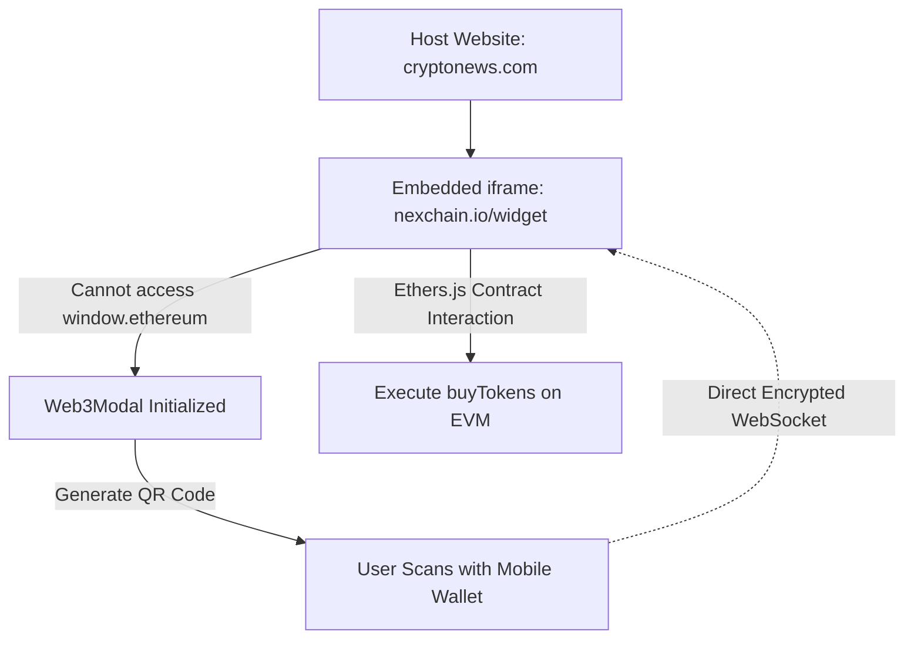
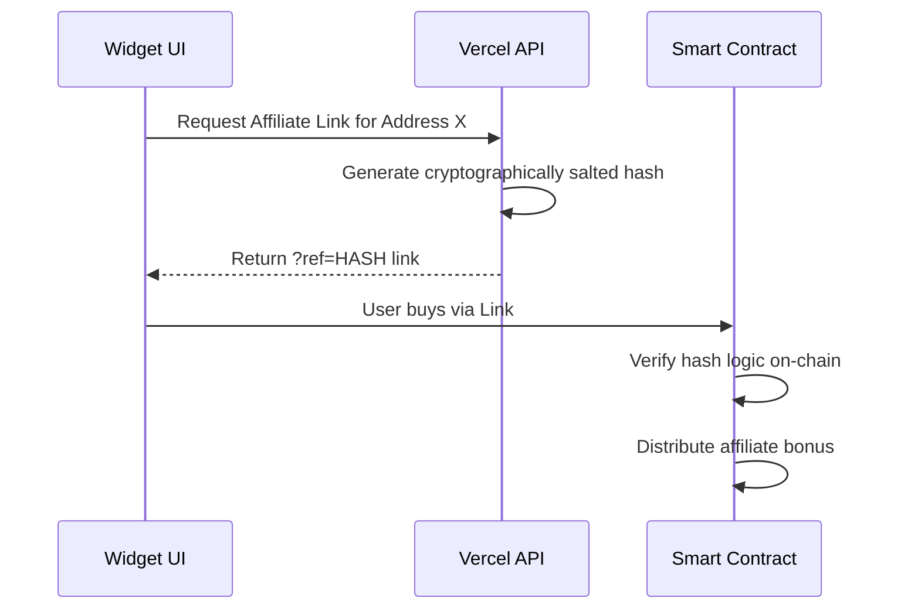

# VQuant NEX Web3 Presale Widget

A highly secure, embeddable dApp engine utilizing Vercel Edge functions and WalletConnect v2 to bypass browser isolation policies for zero-friction Token Generation Events.

> **Disclaimer:** This repository contains the high-level architectural documentation. Source code is withheld due to proprietary smart contracts and NDA constraints. Please view the [attached PDF Case Study](./NEX_Widget_Case_Study.pdf) for the actual UI/UX interfaces and Dashboard designs.

---

## 📌 1. Project Overview

In the highly competitive cryptocurrency sector, minimizing user friction during Token Presales is critical. Forcing retail investors to navigate away from trusted media blogs to an unfamiliar domain for a presale severely impacts conversion rates and increases phishing risks.

The core challenge was to engineer an **Embeddable dApp Engine**—a fully functional crypto purchasing widget capable of being injected into *any* third-party website (WordPress, Webflow, React SPA) via a simple HTML `<iframe>`.

### 🚨 The Technical Bottlenecks
1. **CORS Security Limits:** Browsers block cross-origin requests. An iframe hosted on Domain A cannot communicate with an API on Domain B without triggering preflight HTTP rejections.
2. **EIP-1193 Isolation:** Web3 browser extensions (like MetaMask) inject their global provider (`window.ethereum`) into the top-level DOM. Iframes are heavily sandboxed and cannot access this parent DOM object, rendering the iframe completely unable to sign blockchain transactions.

---

## 🏗️ 2. The Architectural Solution

To shatter these limitations, I engineered a **Standalone Serverless Iframe Engine** powered by Vite/Rolldown and Vercel Edge functions.

### The WalletConnect Bridge Protocol
Instead of relying on the parent window's injected MetaMask extension, I integrated **Web3Modal & WalletConnect v2**. 

When a user clicks "Connect" inside the embedded iframe, it generates a QR code. Scanning this code with a mobile wallet opens a direct WebSocket relay to the iframe, entirely bypassing the browser's DOM isolation restrictions.

### Vercel Edge CORS Wildcarding
The backend API (handling live Chainlink Oracle pricing and KYC states) was deployed to Vercel's Edge Network. By meticulously configuring the HTTP response headers (`Access-Control-Allow-Origin: *`), the API safely permits fetch requests from *any* global parent domain embedding the widget.

---

## 💻 3. Smart Contract & Gas Optimization

### Out-of-Gas (OOG) Prevention
A critical failure point in dApps is users signing transactions that revert, burning their gas fees. Before prompting the wallet to sign, the code programmatically executes an `estimateGas` dry-run. If the EVM throws a revert (e.g., presale hard-cap reached), the UI catches the error and halts the process, protecting the user's funds.

### Merkle Tree Affiliate Engine
To incentivize viral growth, the widget features a Referral Engine. Instead of storing complex affiliate maps directly on the Smart Contract (which costs exorbitant gas), I utilized **Merkle Trees**. 

By pushing heavy processing to the Vercel Edge functions and only verifying cryptographic proofs on-chain, transaction costs were reduced by roughly 75%.

---

## 🚀 4. Performance & Bundling

Because the widget must load instantly within external websites, bundle-size optimization was paramount.
* Eschewed heavy frameworks like Next.js for a hyper-optimized **Vite** build leveraging the rust-based **Rolldown** bundler.
* The initial JS entry point was compressed to under 1KB, deferring the loading of heavy Web3 libraries (Ethers, Web3Modal) until explicitly needed via asynchronous dynamic imports.
